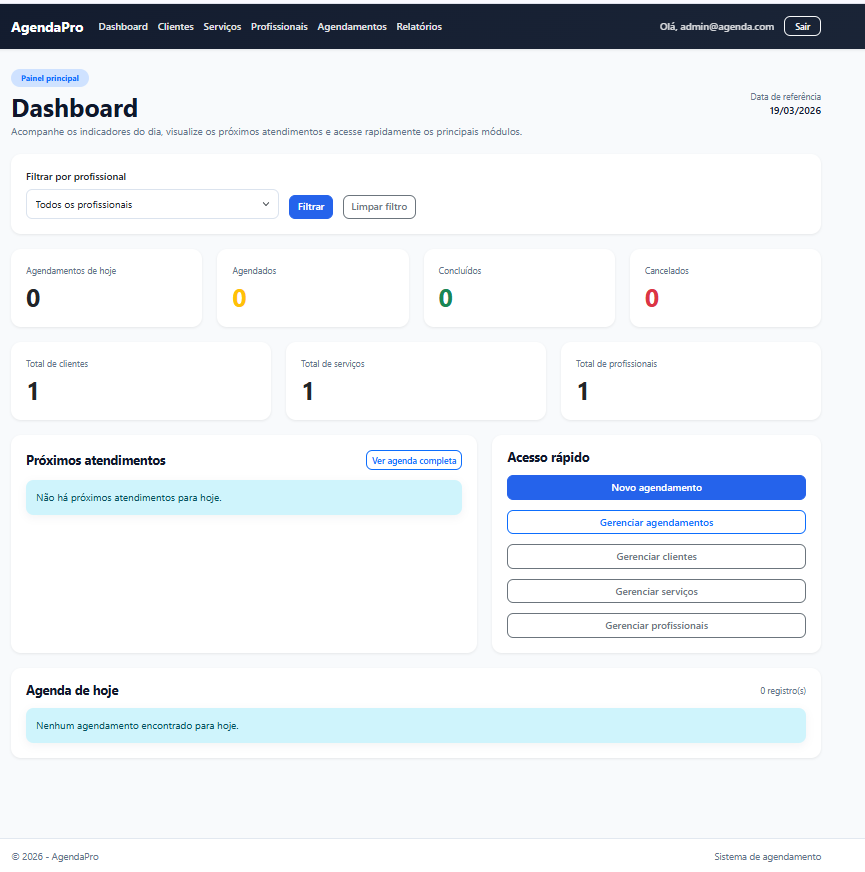
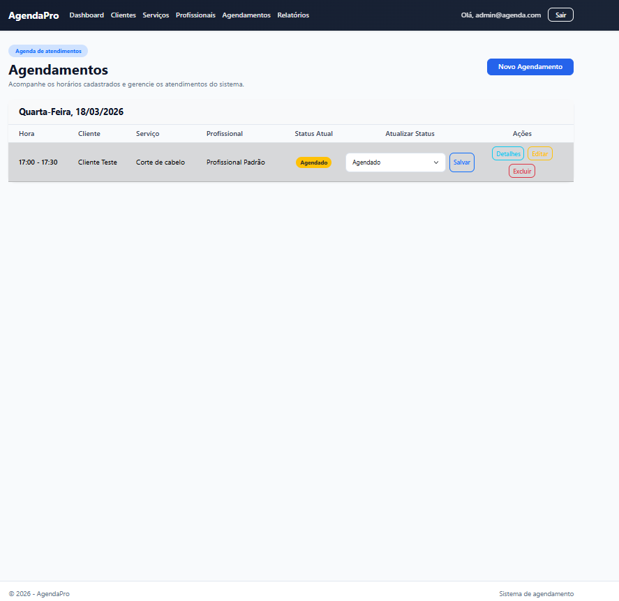
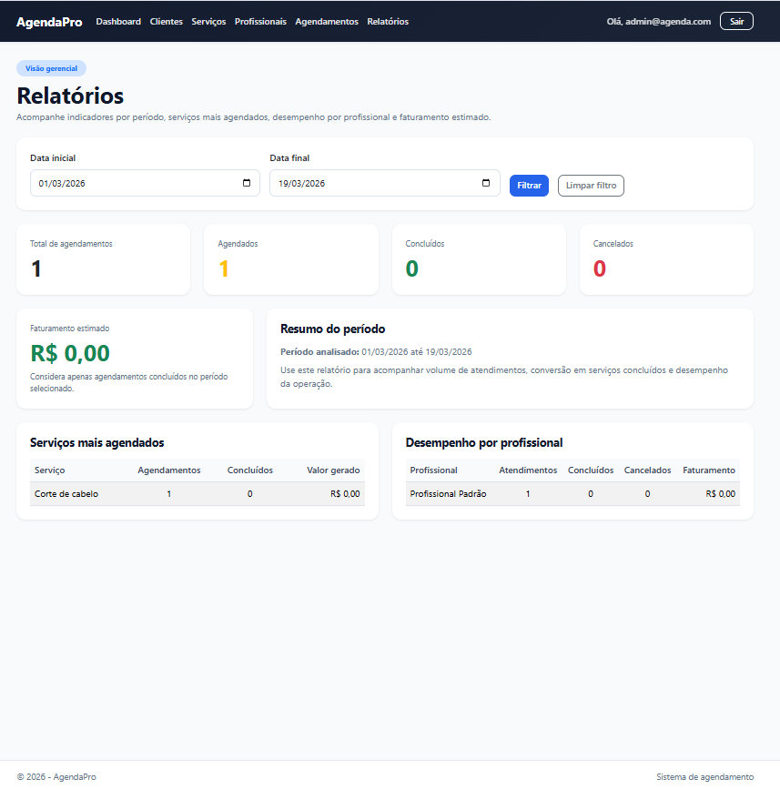

# 📅 AgendaPro

🇺🇸 English | [🇧🇷 Português](README.pt-BR.md)


A **service appointment management web application** built with **ASP.NET Core MVC, C#, and SQL Server**.

AgendaPro helps companies and service professionals organize appointments, manage customers and services, and track the status of each appointment through a simple and intuitive interface.

---

# 🖥️ System Preview







Main features:

- Daily dashboard
- Customer management
- Service management
- Professional management
- Appointment scheduling
- Appointment status tracking

---

# 🎯 Project Goal

The main objective of this project is to provide businesses and professionals with an efficient way to manage service appointments by keeping track of:

- who will be served
- appointment date and time
- assigned professional
- requested service
- appointment status

---

# ✨ Features

- ASP.NET Core Identity authentication
- Role-based authorization (Admin & Professional)
- Customer management
- Service management
- Professional management
- Appointment creation and editing
- Schedule conflict validation
- Appointment status updates
- Daily dashboard with key metrics
- Management reports by date range
- Responsive Bootstrap interface

---

# 🧰 Technologies

## Backend

- .NET 9
- ASP.NET Core MVC
- C#
- Entity Framework Core

## Database

- SQL Server

## Frontend

- Razor Views
- Bootstrap 5
- HTML5
- CSS3

## Tools

- Git
- GitHub
- Visual Studio
- Visual Studio Code

---

# 👥 User Roles

## 👑 Administrator

- Manage customers
- Manage services
- Manage professionals
- Create and edit appointments
- View the complete schedule

## 👨‍🔧 Professional

- View assigned appointments
- Update appointment status

---

# 🔑 Demo Credentials

To simplify evaluation, the following users are automatically created through database seeding.

## 👑 Administrator

**Email:** admin@agenda.com

**Password:** Admin@123

## 👨‍🔧 Professional

**Email:** profissional@agenda.com

**Password:** Prof@123

> ⚠️ These demo accounts are automatically created during application startup.

---

# 📋 MVP Features

- User authentication with ASP.NET Core Identity
- Customer management
- Service management
- Professional management
- Appointment scheduling
- Appointment status tracking
- Dashboard
- Appointment history
- Responsive layout

---

# 🏗️ Project Architecture

The project follows the **ASP.NET Core MVC** architecture.

```text
AgendaPro
│
├── Controllers
├── Models
├── ViewModels
├── Data
│   ├── ApplicationDbContext
│   └── Migrations
├── Views
├── wwwroot
└── Program.cs
```

---

# 🗄️ Database Structure

Main entities:

- Customers
- Services
- Professionals
- Appointments
- Users (ASP.NET Core Identity)

Relationships:

- One customer can have multiple appointments.
- One professional can have multiple appointments.
- One service can be associated with multiple appointments.

---

# 🚀 Running the Project

### 1. Clone the repository

```bash
git clone https://github.com/LucianoSF1992/AgendaPro.git
```

### 2. Navigate to the project folder

```bash
cd AgendaPro
```

### 3. Restore dependencies

```bash
dotnet restore
```

### 4. Apply migrations

```bash
dotnet ef database update
```

### 5. Run the application

```bash
dotnet run
```

The application will be available at a local address similar to:

```
http://localhost:5139
```

---

# 📊 Project Status

🚧 **Under Development (MVP Completed)**

The project is being developed incrementally, with new features added over time.

---

# 📌 Project Roadmap

## 🚧 Phase 1 — Initial Setup

- [x] Project structure
- [x] Database configuration
- [x] Authentication system

## 📋 Phase 2 — Management Modules

- [x] Customer management
- [x] Service management
- [x] Professional management

## 📅 Phase 3 — Scheduling

- [x] Appointment creation
- [x] Schedule conflict validation
- [x] Status updates

## 🎨 Phase 4 — User Interface

- [x] Appointment grouping by date
- [x] Status badges
- [x] Highlight past appointments
- [x] Global layout customization
- [x] ASP.NET Identity UI customization

## 📊 Phase 5 — Dashboard

- [x] Daily overview
- [x] Professional filtering
- [x] Appointment statistics

## 🕘 Phase 6 — Reports

- [x] Date range reports
- [x] Most requested services
- [x] Professional performance
- [x] Estimated revenue

## ✅ Phase 7 — Production Readiness

- [x] Permission review
- [x] End-to-end testing
- [x] Responsive design improvements
- [x] Error handling
- [x] Production configuration review

## 🚀 Phase 8 — Deployment

- [x] Hostinger deployment
- [x] Subdomain configuration
- [x] Production database setup
- [x] Production validation

## 🌱 Phase 9 — Future Improvements

- [ ] Monthly/Weekly calendar
- [ ] Time slot blocking
- [ ] Quick appointment editing
- [ ] PDF/Excel export
- [ ] Email confirmations
- [ ] Advanced permission management

---

# 🌐 Live Demo

The application is available at:

https://agendapro.lucianoferreiradev.com

---

# 📚 What I Learned

During the development of this project, I applied and improved my knowledge of:

- ASP.NET Core MVC
- ASP.NET Core Identity
- Entity Framework Core
- Entity relationships
- ViewModels
- Clean project organization
- Git version control
- Role-based authorization
- Responsive UI development

---

# 👨‍💻 Author

**Luciano Silva Ferreira**

Full Stack Software Developer focused on **.NET** and **ASP.NET Core**.

---

# 🔗 Contact

🌐 **Portfolio**

https://www.lucianoferreiradev.com

💼 **LinkedIn**

https://www.linkedin.com/in/lucianoferreira92/

💻 **GitHub**

https://github.com/LucianoSF1992